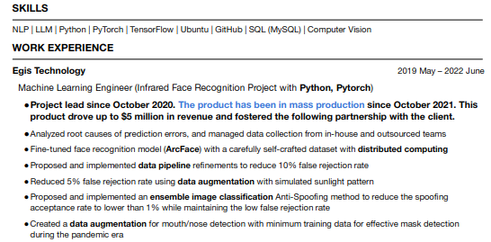
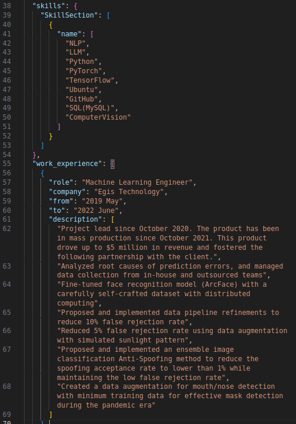

# PDF Resume Parsing

This project is the first task of [resume tailoring project](https://github.com/gabrielchen65/resume_tailoring_llm), aimed to extract the information from the unstructured PDF resume and store it into the structure JSON format.

### Input resume (only showing a section here)


### Output JSON format


## Getting Started
### Getting the LLM Model
First, let's get the open-source LLM model. I'm running this project with a RTX 3090 24G VRAM and I chose [Mistral 7B instruct v0.2](https://huggingface.co/mistralai/Mistral-7B-Instruct-v0.2) to run as my model to parse the semantic text. However, this 7B model does not fit in my GPU coming out of the box, so the quantization is needed. 

There are two ways to do it:

1. Use [Ollama docker image](https://hub.docker.com/r/ollama/quantize) for quantization 
2. Get the already quantized models from [here](https://huggingface.co/TheBloke/Mistral-7B-Instruct-v0.2-GGUF)

### Install the python libraries

Then, Install the prerequistes, it is recommended to install with environments like miniconda:
``` 
pip install -r requirements.txt
```
### Install the llama-cpp-python
(For more details of the following steps, you can find them [here](https://python.langchain.com/docs/integrations/llms/llamacpp/))

Once above steps are done, we want to install the llama-cpp-python, the reason why I'm using this library to call LLM because it support a function that force LLM to output JSON format only with [json.gbnf](https://github.com/ggerganov/llama.cpp/blob/master/grammars/json.gbnf). 

To install with CPU version:
```
pip install --upgrade --quiet  llama-cpp-python
```

To install with GPU version:

please check if you have the CUDA installed with:
```
nvcc --version
```
It should be giving you something like this:

(otherwise you won't be able to use GPU with llama-cpp-python)
```
nvcc: NVIDIA (R) Cuda compiler driver
Copyright (c) 2005-2023 NVIDIA Corporation
Built on Wed_Nov_22_10:17:15_PST_2023
Cuda compilation tools, release 12.3, V12.3.107
Build cuda_12.3.r12.3/compiler.33567101_0
```
Then install the library with:
```
CMAKE_ARGS="-DLLAMA_CUBLAS=on" FORCE_CMAKE=1 pip install llama-cpp-python --no-cache-dir
```
I added the ```--no-cache-dir``` here because my computer cached the CPU version and it always choose that cpu version to install. If you install the CPU version already, try this to force reinstall:
```
CMAKE_ARGS="-DLLAMA_CUBLAS=on" FORCE_CMAKE=1 pip install --upgrade --force-reinstall llama-cpp-python --no-cache-dir
```
And the last step for the installation is here, add it to the bash:
```
export LLAMA_CPP_LIB={path to your python environment}/lib/python3.11/site-packages/llama_cpp/libllama.so
```

## Usage

Place your resume in ```./data/``` folder and run:
```
python main.py
```
